# ✈️ Enjoy Trip

> 국내 관광지 정보를 통해 여행 계획 및 공유 서비스를 제공하는 웹 사이트

## 설치방법

:heavy_check_mark: enjoytrip_frontend

- vscode로 실행

```sh
npm install
```

```sh
npm run dev
```

:heavy_check_mark: enjoytrip_backend

- SQL 폴더의 sql 파일 import
- application.properties에 DB 세팅
- sts에서 Run As Spring Boot App

## 프로젝트 팀원

<table align="center">
    <tr align="center">
        <td style="min-width: 150px;">
            <a href="https://github.com/JungHun98">
              
              <br />
              <b>j7papa</b>
            </a>
        </td>
        <td style="min-width: 150px;">
            <a href="https://github.com/jinseok-kr">
              
              <br />
              <b>jinseok-kr</b>
            </a> 
        </td>
        <td style="min-width: 150px;">
            <a href="https://github.com/jungyeojinn">
              
              <br />
              <b>jungyeojinn</b>
            </a> 
        </td>
    </tr>
    <tr align="center">
        <td>
            김정훈
        </td>
        <td>
            이진석
        </td>
        <td>
            정여진
        </td>
    </tr>
    <tr align="center">
        <td>
            프론트엔드
        </td>
        <td>
            백엔드
        </td>
        <td>
            백엔드
        </td>
    </tr>
</table>

## 🛠️ 역할 담당

| 이름   | 역할                                                                                                                                |
| ------ | ----------------------------------------------------------------------------------------------------------------------------------- |
| 김정훈 | 화면 디자인, Axios를 이용한 비동기 통신, Kakao Map API를 이용한 지도, 위치 데이터 처리                                              |
| 이진석 | DB 설계 및 구축, API 컨벤션 관리, 코드 형상 관리, 예외 처리 규칙 설계, 유저 관련 기능, 관광지 정보 기능, JWT 인증 기능, 게시판 기능 |
| 정여진 | 프로젝트 기록 및 문서화, 예외 처리 규칙 설계, 파일 업로드 및 저장 기능, 공지사항 기능, 댓글 기능                                    |

## 개발 기간

2024.05.16. ~ 2024.05.24.

# 📌프로젝트 소개

# EnjoyTrip: 당신만의 맞춤 여행 계획을 세워보세요!

대한민국의 아름다운 관광지를 한눈에 볼 수 있는 EnjoyTrip에서는 여러분이 원하는 여행지를 선택하여 나만의 여행 계획을 쉽게 세울 수 있습니다. 전국 각지의 숨겨진 보석 같은 명소부터 유명 관광지까지, EnjoyTrip은 다양하고 풍부한 정보를 제공합니다.

## 🌟 주요 기능

- **여행지 소개**: 전국의 다양한 관광지 정보와 사진, 방문자 리뷰를 확인할 수 있습니다.
- **여행 계획 세우기**: 관심 가는 여행지를 선택하여 나만의 여행 일정을 구성해 보세요.
- **여행 후기 게시판**: 여행을 다녀온 후 그 경험을 공유하고 싶으신가요? 후기 게시판에서 생생한 이야기를 나누어 보세요.
- **나만의 핫플레이스 등록**: 여러분이 발견한 숨은 명소를 다른 사람들과 공유해 보세요.
- **댓글 및 좋아요 기능**: 다른 사용자의 여행 계획이나 핫플레이스에 좋아요를 통해 추천할 수 있습니다.

## 🗺 여행지 선택하기

EnjoyTrip에서는 사용자가 방문할 여행지의 다양한 관광지, 음식점, 숙소 등 다양한 장소를 소개해 드립니다. 바다가 보고 싶으신가요? 아니면 산과 자연을 선호하시나요? 아니면 문화와 역사를 체험하고 싶으신가요? 여러분의 선호에 맞춰 최적의 여행지를 찾아드립니다.

## ✍️ 여행 후기와 핫플레이스 공유

여행을 마치고 나면, 여행 후기 게시판에 그 경험을 남겨주세요. 또한, 여러분만이 알고 있는 특별한 장소를 나만의 핫플레이스로 등록하여 다른 여행자들과 정보를 공유할 수 있습니다. 여러분의 소중한 경험이 다른 사람들에게 영감을 줄 수 있습니다.

## 🚩 여행 계획 고민은 끝

어디를 여행해야 될 지 모르겠어요? 여행 고수들이 작성한 여러 여행 계획을 확인하세요. 다른 사람들이 작성한 여행 계획들을 확인하고 마음에 드는 계획을 선택하세요. 여러분은 고민할 필요 없이 떠나면 됩니다.

## ❤️ 여행을 사랑하는 모든 이들을 위한 커뮤니티

EnjoyTrip은 여행을 사랑하는 모든 분들이 정보를 공유하고 소통할 수 있는 공간입니다. 여행 계획을 세우고, 직접 다녀온 후기를 남기며, 나만의 핫플레이스를 공유하면서 여행에 대한 열정을 함께 나눠 보세요.

오늘 바로 EnjoyTrip에 접속하여 여러분만의 여행 계획을 시작해 보세요!

## 기술 스택

### BackEnd


### FrontEnd


### 협업툴


## ERD

<p align="center">
 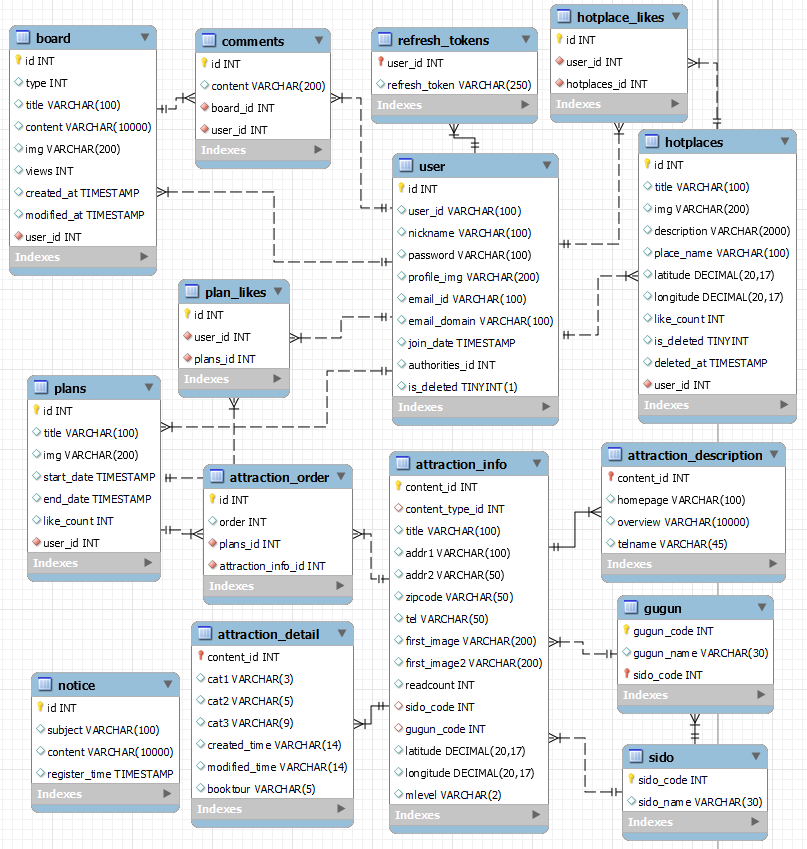
</p>

## 아키텍처

<p align="center">
 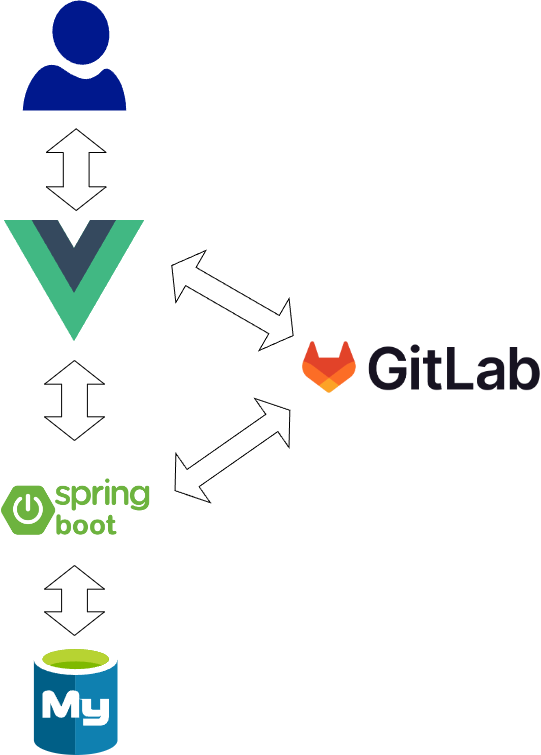
</p>

## 요구사항

| 회원, 로그인 관리 | 회원가입, JWT를 이용한 토큰 기반 인증 처리                    |
| ----------------- | ------------------------------------------------------------- |
| 관광지 정보       | 한국관광공사 지역별 관광지 정보를 이용하여 지역별 관광지 조회 |
| 핫플레이스        | 사용자가 핫플레이스를 등록하고 수정, 삭제.                    |
| 여행 계획         | 사용자가 여행 계획을 작성하고 수정, 삭제. 좋아요/좋아요 해제  |
| 공지사항          | 공지사항 등록, 수정, 삭제, 조회                               |

## 주요 기능 소개

### 사용자

<p align="center">
 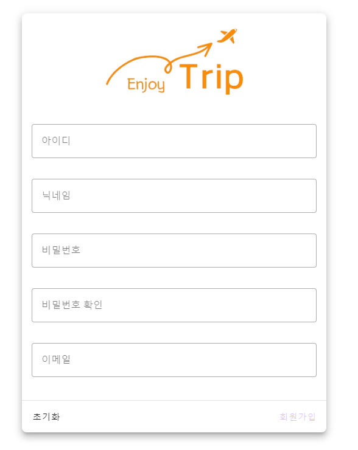
</p>

<p align="center">
 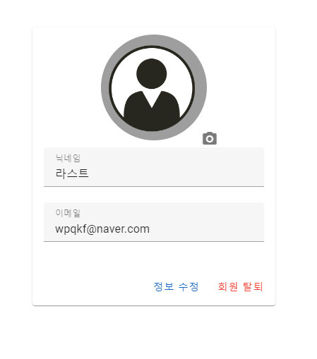
</p>

- 회원가입
- 회원 정보 조회, 수정, 삭제

### 여행계획

<p align="center">
 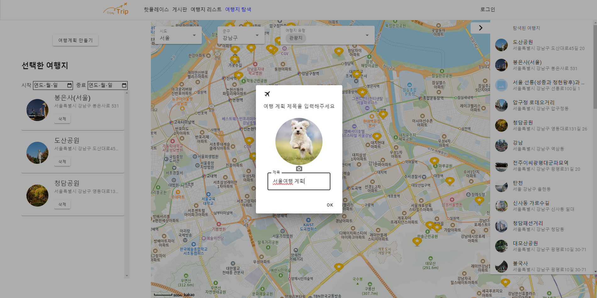
</p>

<p align="center">
 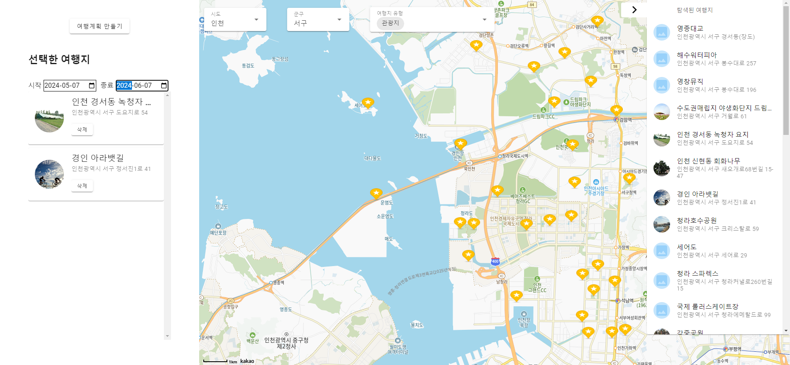
</p>

- 여행 계획 수정, 삭제
- 조회한 관광지를 활용하여 여행 계획, 여행 경로를 저장

### 여행지

<p align="center">
 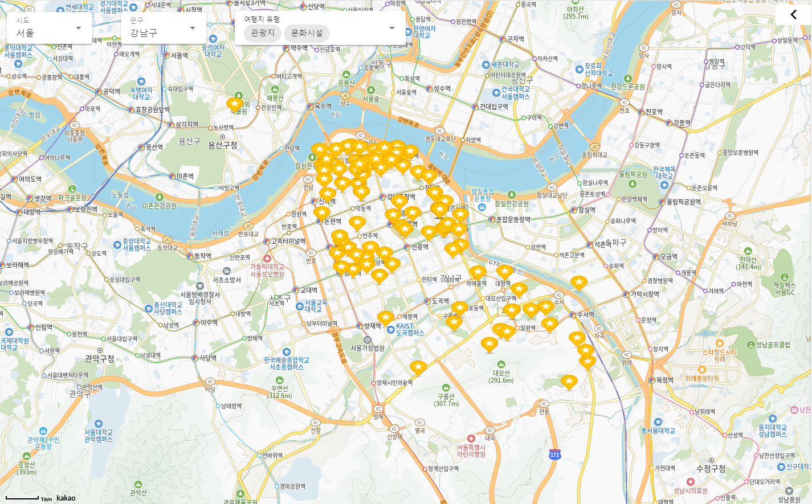
</p>

<p align="center">
 
</p>

- 지역별 관광지 정보 수집 한국관광공사 : 지역별 관광지 정보를 얻어와 화면에 표시
- 관광지 정보를 지역별 원하는 컨텐츠 별 조회

### 게시판

<p align="center">
 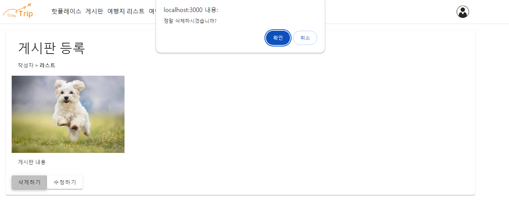
</p>

<p align="center">
 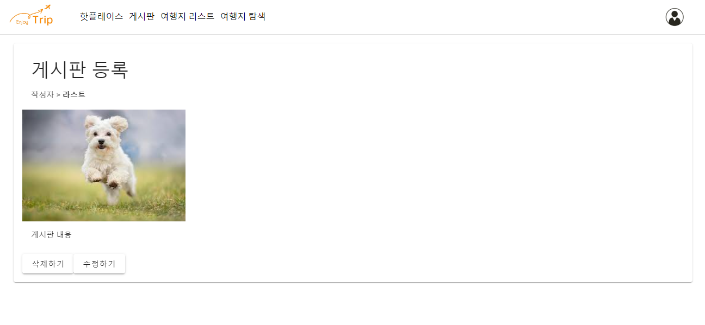
</p>

<p align="center">
 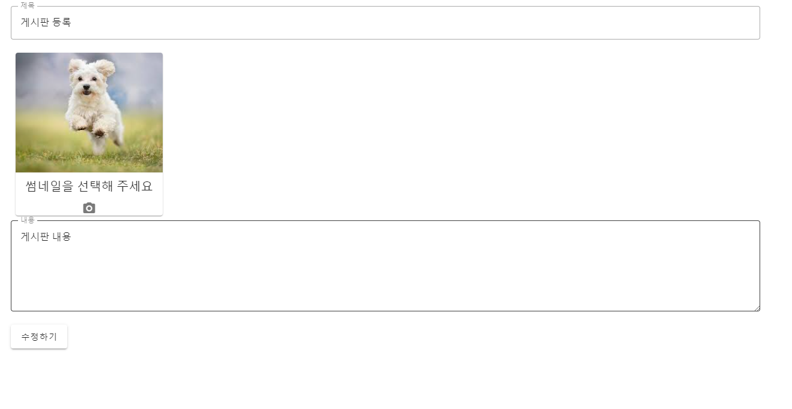
</p>

- 게시글 등록, 조회, 수정, 삭제

### 핫플레이스

<p align="center">
 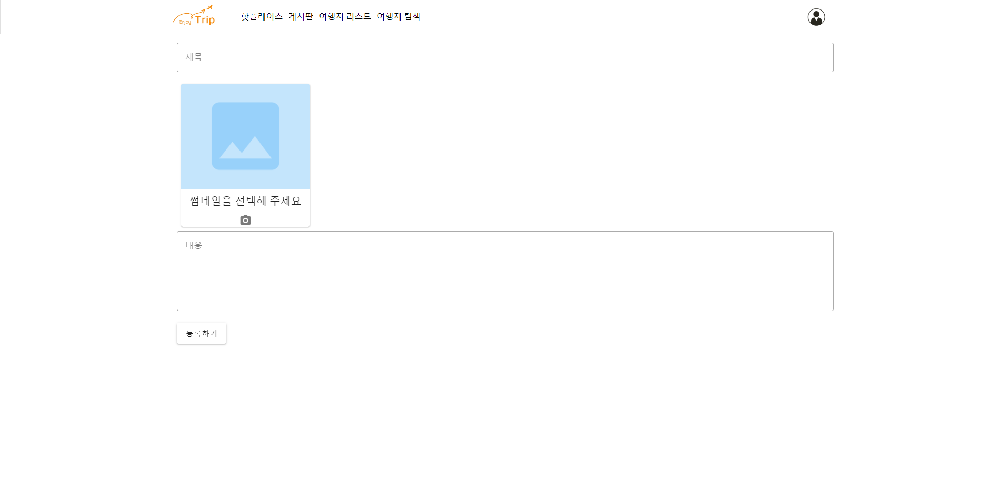
</p>

<p align="center">
 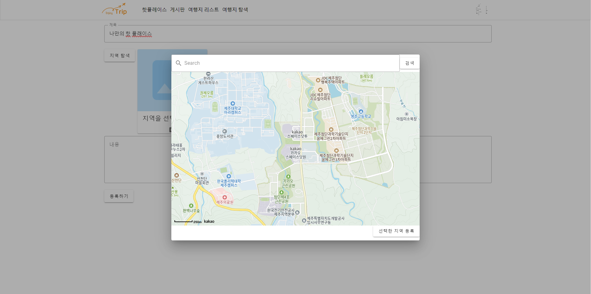
</p>

- 핫플레이스 글 수정, 삭제
- 지도와 사진을 활용한 hotplace 등록
